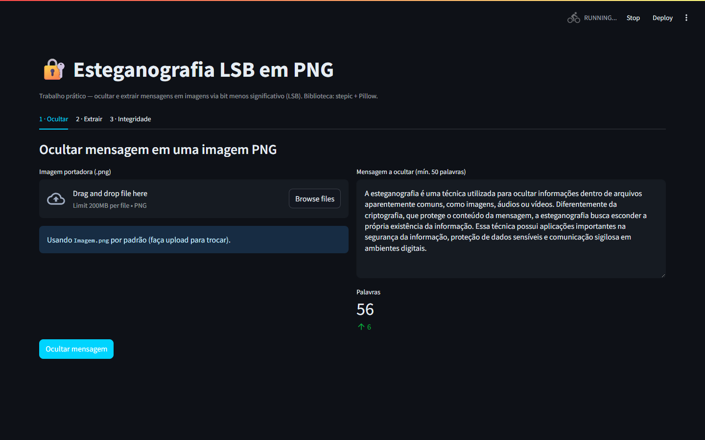
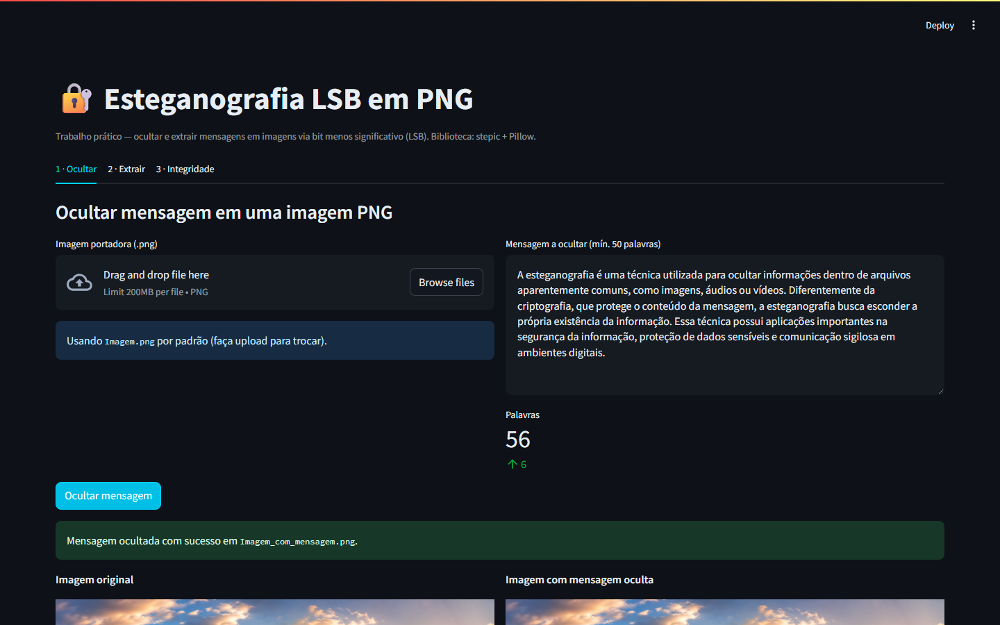
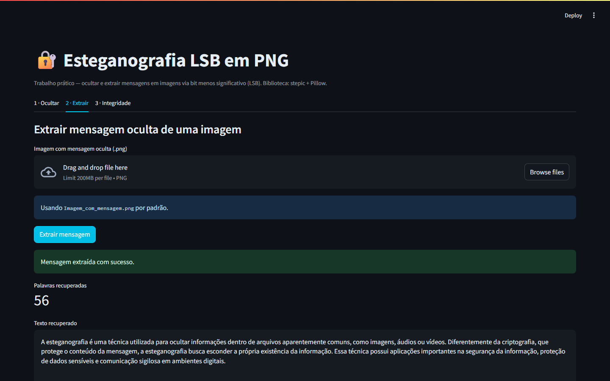
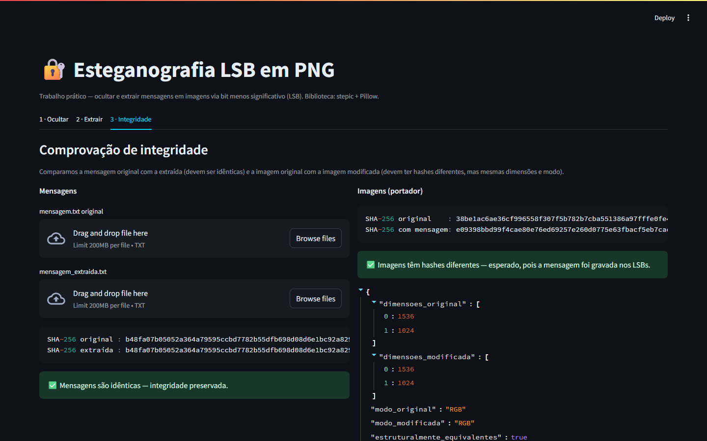

# Esteganografia LSB em Imagens PNG

**Trabalho prático — Parte 2: Implementação**
Autor: Pedro Casaroti

## 1. Introdução

A esteganografia é uma técnica utilizada para ocultar informações dentro de arquivos aparentemente comuns, como imagens, áudios ou vídeos. Diferentemente da criptografia, que protege o conteúdo da mensagem, a esteganografia busca esconder a própria existência da informação.

Este trabalho implementa esteganografia pelo método **LSB (Least Significant Bit)** — o bit menos significativo de cada canal de cor (R, G, B) de cada pixel é usado para armazenar bits da mensagem. Como o LSB altera a cor em apenas 1/256, a modificação é imperceptível ao olho humano, mas pode ser revertida bit a bit por quem conhece o algoritmo.

## 2. Ferramentas utilizadas

| Ferramenta | Versão  | Uso |
|------------|---------|-----|
| Python     | 3.13    | Linguagem |
| stepic     | 0.5.0   | Codificação/decodificação LSB |
| Pillow     | 11.0.0  | Manipulação de imagens |
| Streamlit  | 1.40.2  | Interface gráfica |
| pytest     | 8.3.4   | Testes automatizados |

A escolha por **Python + stepic** segue exatamente a opção sugerida pelo enunciado ("Linguagens de programação — por exemplo, Python com bibliotecas como steganography ou stepic").

## 3. Arquivos do trabalho

- `Imagem.png` — arquivo portador (PNG fornecido).
- `mensagem.txt` — mensagem textual a ser ocultada (60 palavras, > 50 exigidas).
- `Imagem_com_mensagem.png` — saída gerada pelo programa.
- `mensagem_extraida.txt` — texto recuperado a partir da imagem com mensagem.

## 4. Instalação e execução

```powershell
# 1. Entrar na pasta do projeto
cd projeto_esteganografia

# 2. Instalar dependências
pip install -r requirements.txt

# 3. Rodar a interface
streamlit run app.py
```

A interface abre automaticamente em `http://localhost:8501`.

Para rodar os testes automatizados:
```powershell
pytest tests/ -v
```

## 5. Código-fonte

### `stego.py` — Lógica de esteganografia

Três funções puras, testáveis isoladamente:

- **`ocultar(imagem_path, mensagem, saida_path)`** — abre a imagem, chama `stepic.encode()` para gravar a mensagem nos LSBs dos canais RGB e salva o resultado como PNG (formato sem perda; JPEG destruiria os bits).
- **`extrair(imagem_path)`** — chama `stepic.decode()` na imagem e retorna o texto em UTF-8. Inclui ajuste de codificação porque `stepic 0.5.0` devolve uma `str` em latin-1 — re-encodamos como latin-1 para recuperar os bytes originais e decodificamos como UTF-8 (assim caracteres acentuados são preservados).
- **`verificar_integridade(arquivo_a, arquivo_b)`** — calcula SHA-256 dos dois arquivos e retorna um dicionário indicando se são iguais.

O código completo está em [`stego.py`](stego.py).

### `app.py` — Interface Streamlit

Três abas:
1. **Ocultar** — upload da imagem + área de texto da mensagem → gera `Imagem_com_mensagem.png`.
2. **Extrair** — upload da imagem com mensagem → mostra texto recuperado.
3. **Integridade** — compara hashes SHA-256 e mostra ✅ / ❌.

Código completo em [`app.py`](app.py).

## 6. Capturas de tela

### 6.1 Aba "Ocultar" — antes da execução



### 6.2 Aba "Ocultar" — depois da execução (comparação lado a lado)



### 6.3 Aba "Extrair" — mensagem recuperada



### 6.4 Aba "Integridade" — hashes SHA-256



## 7. Resultados — comprovação de integridade

### 7.1 Integridade da mensagem

Comparação SHA-256 entre `mensagem.txt` original e `mensagem_extraida.txt`:

```
SHA-256 original : b48fa07b05052a364a79595ccbd7782b55dfb698d08d6e1bc92a829dea5b4bae
SHA-256 extraída : b48fa07b05052a364a79595ccbd7782b55dfb698d08d6e1bc92a829dea5b4bae
Iguais? ✅ SIM
```

Conclusão: a mensagem foi recuperada **sem qualquer perda** — bit por bit idêntica ao original. A esteganografia é totalmente reversível.

### 7.2 Integridade do arquivo portador

Comparação entre `Imagem.png` e `Imagem_com_mensagem.png`:

```
SHA-256 original    : 38be1ac6ae36cf996558f307f5b782b7cba551386a97fffe0fe4d1a455cb3b01
SHA-256 com mensagem: e09398bbd99f4cae80e76ed69257e260d0775e63fbacf5eb7cac57c147582e90
Iguais? ❌ NÃO (esperado — a mensagem foi gravada nos LSBs)

Dimensões original   : 1536x1024 — igual à modificada
Modo de cor original : RGB — igual à modificada
```

Conclusão: a imagem foi alterada em bytes (necessário para carregar a mensagem), mas:
- Continua sendo um PNG válido;
- Mantém exatamente as mesmas dimensões e modo de cor;
- É **visualmente equivalente** à original (ver capturas 6.2).

A integridade visual/funcional do portador foi preservada, que é o objetivo prático da esteganografia.

## 8. Discussão

- **Formato obrigatório PNG:** usamos PNG porque a compressão é sem perda. Salvar a saída como JPEG destruiria os bits LSB e a mensagem se perderia.
- **Capacidade:** cada pixel armazena 3 bits (1 por canal RGB). A imagem usada (1536x1024 RGB) armazena ~589.824 bytes; nossa mensagem de ~441 bytes cabe folgadamente.
- **Limitações:** o método LSB é detectável por análise estatística (esteganálise). Em cenários reais, costuma-se combinar com criptografia antes de ocultar, para que mesmo a detecção não revele o conteúdo.

## 9. Conclusão

O trabalho demonstrou, com código próprio e interface gráfica, que é possível ocultar uma mensagem textual em uma imagem PNG via LSB e recuperá-la integralmente. A integridade da mensagem foi comprovada por SHA-256 (idênticos), e a integridade visual do portador foi comprovada pela equivalência de dimensões/modo/aparência — apesar da diferença esperada em bytes brutos.
